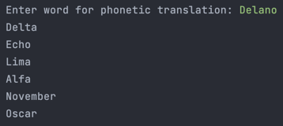

# NATO-Phonetic-Translator
This simple project gets a word as an input and then translates it into a phonetic representation of itself, using list comprehensions to do so.



## Installation
1. Create a directory on your machine to house it. I find "TRANSLATE" to work just fine!
```bash 
mkdir TRANSLATE
```
2. Look above and select "Code"
3. From here, copy the HTTPS web URL
4. Return to your terminal and clone the project.
```bash
git clone https://github.com/LanoCodes/NATO-Phonetic-Translator.git
```
5. Using your favorite IDE, open the TRANSLATE folder
6. Navigate to main and run from there. You will need to have the pandas package installed.

## Usage
- When prompted, enter a word and then press enter. In my case above, I entered a name.
- After that, you'll be shown what a phonetic translation of your word looks like.